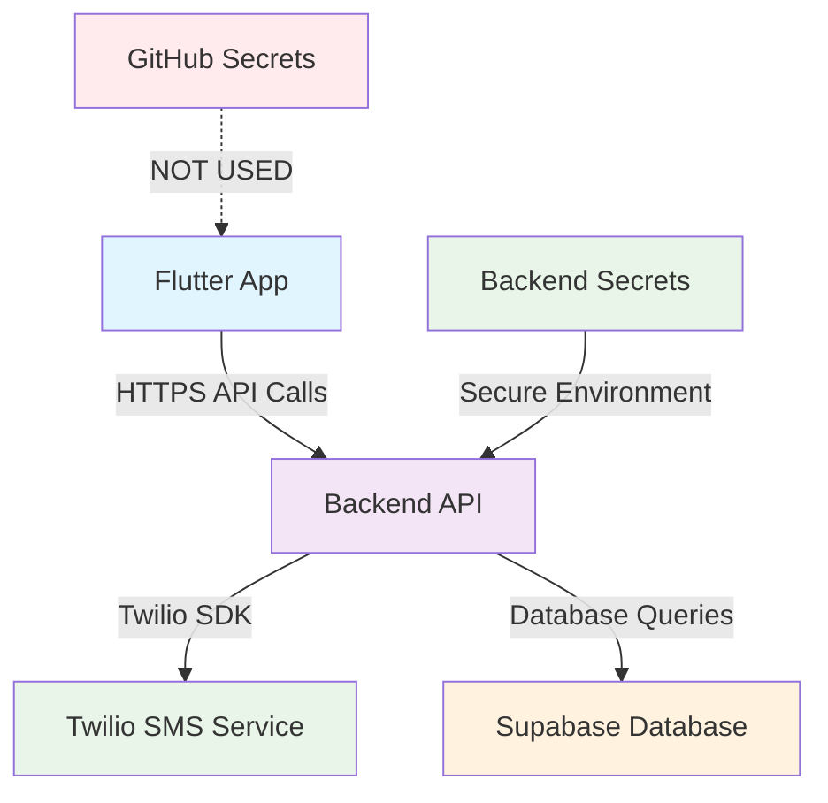

# 🔐 GitHub Secrets Setup for Production SMS

## 🎯 Overview

This guide explains how to configure **GitHub Secrets** for production SMS verification in your Exam Coach app deployed via GitHub Actions.

## 🔧 Required GitHub Secrets

### **📋 Backend API Secrets**

Your app uses a secure backend API that requires the following secrets to be configured in your **backend deployment** (not in GitHub repository):

| Secret Name | Description | Example Value |
|-------------|-------------|---------------|
| `TWILIO_ACCOUNT_SID` | Your Twilio Account SID | `ACxxxxxxxxxxxxxxxxxxxxxxxxxxxxx` |
| `TWILIO_AUTH_TOKEN` | Your Twilio Auth Token | `your_auth_token_here` |
| `TWILIO_PHONE_NUMBER` | Your Twilio Phone Number | `+1234567890` |
| `DATABASE_URL` | Supabase Database URL | `https://your-project.supabase.co` |
| `SUPABASE_ANON_KEY` | Supabase Anonymous Key | `eyJhbGciOiJIUzI1NiIsInR5cCI6IkpXVCJ9...` |

### **🚨 Important Security Note**

**These secrets are NOT stored in your GitHub repository.** They are configured in your **backend API deployment** (Vercel/Netlify/etc.) for security.

## 🏗️ Backend API Architecture



## 🔐 Backend Configuration

### **Option 1: Vercel Deployment**

```bash
# Set environment variables in Vercel Dashboard
# Or use Vercel CLI:
vercel env add TWILIO_ACCOUNT_SID
vercel env add TWILIO_AUTH_TOKEN
vercel env add TWILIO_PHONE_NUMBER
vercel env add DATABASE_URL
vercel env add SUPABASE_ANON_KEY
```

### **Option 2: Netlify Deployment**

```bash
# Set in Netlify Dashboard under Site Settings > Environment Variables
# Or use Netlify CLI:
netlify env:set TWILIO_ACCOUNT_SID your_account_sid
netlify env:set TWILIO_AUTH_TOKEN your_auth_token
netlify env:set TWILIO_PHONE_NUMBER +1234567890
netlify env:set DATABASE_URL https://your-project.supabase.co
netlify env:set SUPABASE_ANON_KEY your_anon_key
```

### **Option 3: Custom Backend**

Set these environment variables in your backend hosting platform:

```env
TWILIO_ACCOUNT_SID=ACxxxxxxxxxxxxxxxxxxxxxxxxxxxxx
TWILIO_AUTH_TOKEN=your_auth_token_here
TWILIO_PHONE_NUMBER=+1234567890
DATABASE_URL=https://your-project.supabase.co
SUPABASE_ANON_KEY=eyJhbGciOiJIUzI1NiIsInR5cCI6IkpXVCJ9...
```

## 🌐 GitHub Actions Environment

### **✅ Current Configuration**

Your GitHub Actions workflow is already configured correctly:

```yaml
# .github/workflows/deploy.yml
- name: Build web app
  run: |
    # CI=true automatically enables production mode
    flutter build web --release --dart-define=CI=true
```

### **🔧 Optional GitHub Repository Variables**

You can optionally set these **repository variables** (not secrets) for configuration:

| Variable Name | Value | Purpose |
|---------------|-------|---------|
| `BACKEND_API_URL` | `https://exam-coach-app.vercel.app/api` | Backend API endpoint |
| `FLUTTER_ENV` | `production` | Force production mode |

**To add repository variables:**
1. Go to your GitHub repository
2. Settings → Secrets and variables → Actions
3. Click "Variables" tab
4. Add the variables above

## 🧪 Testing Environment Detection

### **🔍 Debug Environment Detection**

The app now logs detailed environment information:

```dart
// Automatically logged on app startup:
🔍 Environment Detection:
  CI: true
  GITHUB_ACTIONS: true
  FLUTTER_ENV: false
  NODE_ENV: 
  kDebugMode: false
  kProfileMode: false
  kReleaseMode: true
🚀 Environment: PRODUCTION (Real SMS enabled)
```

### **📱 Test Production SMS**

1. **Deploy to GitHub Pages:**
   ```bash
   git push origin main
   # GitHub Actions will automatically deploy
   ```

2. **Check environment logs in browser console:**
   - Press F12 in browser
   - Go to Console tab
   - Look for environment detection logs

3. **Test SMS flow:**
   - Login with your credentials
   - Real SMS will be sent to your phone
   - Enter the received code

## 🔄 Environment Flow

### **🏠 Local Development**
```
flutter run → kDebugMode=true → Development → Demo SMS codes
```

### **🚀 GitHub Actions**
```
GitHub Actions → CI=true → Production → Real SMS via backend API
```

### **📊 Manual Production Testing**
```
flutter build web --dart-define=CI=true → Production → Real SMS
```

## 🔗 Backend API Endpoints

Your Flutter app calls these secure endpoints:

### **📤 Send SMS**
```http
POST https://exam-coach-app.vercel.app/api/send-otp
Content-Type: application/json

{
  "phoneNumber": "+1234567890"
}
```

### **✅ Verify SMS**
```http
POST https://exam-coach-app.vercel.app/api/verify-otp
Content-Type: application/json

{
  "phoneNumber": "+1234567890",
  "code": "123456"
}
```

## 🛡️ Security Best Practices

### **✅ What's Secure**
- Twilio credentials stored in backend environment variables
- API calls over HTTPS
- No sensitive data in Flutter app or GitHub repository
- Environment-based configuration

### **❌ What to Avoid**
- Never put Twilio credentials in Flutter app
- Never commit sensitive data to GitHub
- Never expose API keys in client-side code

## 🚀 Quick Setup Summary

1. **✅ Flutter App:** Already configured for production SMS
2. **✅ GitHub Actions:** Already configured with CI=true
3. **🔧 Backend API:** Configure Twilio secrets in your backend platform
4. **📱 Test:** Deploy and test real SMS verification

## 🔧 Troubleshooting

### **Issue: Still seeing demo mode in production**
```bash
# Check environment detection logs in browser console
# Ensure CI=true is set in GitHub Actions build command
flutter build web --dart-define=CI=true
```

### **Issue: SMS not sending**
```bash
# Check backend API configuration
# Verify Twilio credentials in backend environment
# Check backend API logs for errors
```

### **Issue: SMS codes not accepted**
```bash
# Ensure backend API is responding correctly
# Check network requests in browser dev tools
# Verify phone number format in registration
```

---

## 📋 Summary

✅ **GitHub repository:** No secrets needed (secure by design)  
🔐 **Backend API:** Configure Twilio secrets in backend platform  
🎯 **GitHub Actions:** Already configured for production SMS  
📱 **Ready to test:** Real SMS in production, demo codes locally

**Your app is architected for maximum security!** 🛡️ 